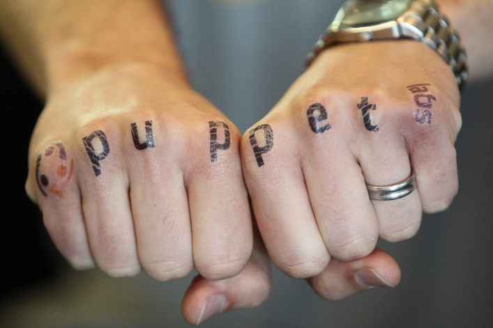

!SLIDE center

# Once upon a CVE:
## Managing Security Events as an Upstream

!SLIDE
## Mike Stahnke
## Engineering Director
## @stahnma

!SLIDE center

!SLIDE
# Security Events

* Puppet Labs
* We handle security events

    * 18 events in 2013
    * 15 ytd in 2013

!SLIDE
# Shipped in lots of way

* Our source code
* Packages from us
* Bundled solutions
* Linux Distributions
* 3rd parties

!SLIDE
# What makes up a security event?

* Code is vulnerable
* Something used in your code is vulnerable

!SLIDE
# What makes them difficult?

* Bits for the fix
* Compatiblity
* Protection of end-users
* Privacy

!SLIDE

##For this we need a proces

##Process have a beginning.

!SLIDE center

!SLIDE center

!SLIDE center
#Vulnerability is discovered/disclosed

!SLIDE center

!SLIDE
#Confirm the vulnerability

* Can you reproduce it
* Is it purely hypothetical?

!SLIDE center

!SLIDE
#Privacy of the vulnerability

* Is the vulnerability known to the public?
* Is it a common pattern that is plubicly known?
* Has the vulnerability been responsiby disclosed?

!SLIDE center

!SLIDE
#Public Knows ?

* Work fast
* Offer public work-arounds if possible
* Be as transparent as possible
* Figure out severity of issue

!SLIDE
#Responsibly disclosed?

## Figure out the impact of issue

!SLIDE center
# Request CVE
## Common Vulnerability Exposure number

!SLIDE center

!SLIDE center
# Determine Impact

!SLIDE center

!SLIDE
* Timeliness
* Protection of users
* Larger Audit of patterns

!SLIDE
# Impact - Attack

* How large is the attack vector?
* Window of time?
* Feature enabled by default?
* Complicated to do?

!SLIDE
# Impact - Risk

* Data integrity
* Confidentiality
* Availability

!SLIDE
# Impact - Type

* Local privlege escalation
* Remote arbitrary code
* DOS
* Bad practice

!SLIDE
# Communication

 * Begin coordination effort
 * People fixing issue need information
 * Doc writers might
 * Website team
 * No downstream comms yet

!SLIDE
# Communication

 * Private bug tracker
 * Request CVE if needed
 * Review who downstream will need info/fixes
 * Decide on versions to support/backport fixes for

!SLIDE

  * Create fixes (in private repo if possible)
  * Run tests (in private)

!SLIDE
# External Communication

  * Testing looks good?
  * Communication confidential release plan (if required)
  * Establish black-out period
  * Give downstream enough time to react (at least 48 hours)

!SLIDE
# Announce

* Shout to educate your userbase
* Send to mailing list
* IRC, blog, website etc

!SLIDE
# Decision points

* Publish tests with exploits? When?
* Publish all new patches in public VCS? When?
* Follow up questions
* Make public bug-tracking issues

!SLIDE
# Attribution

!SLIDE center

!SLIDE center

!SLIDE center

!SLIDE
# Security is a popularity contest
